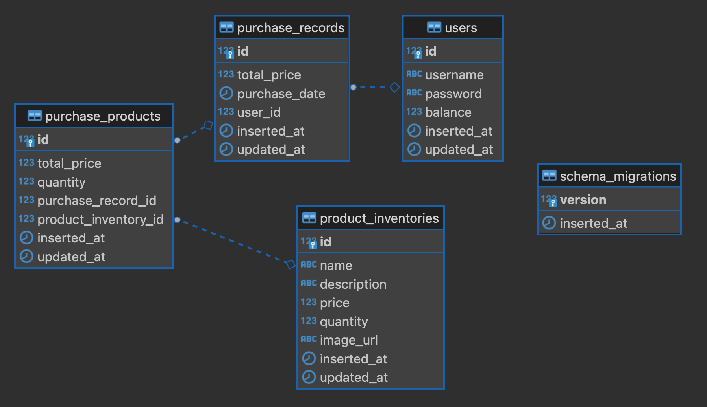
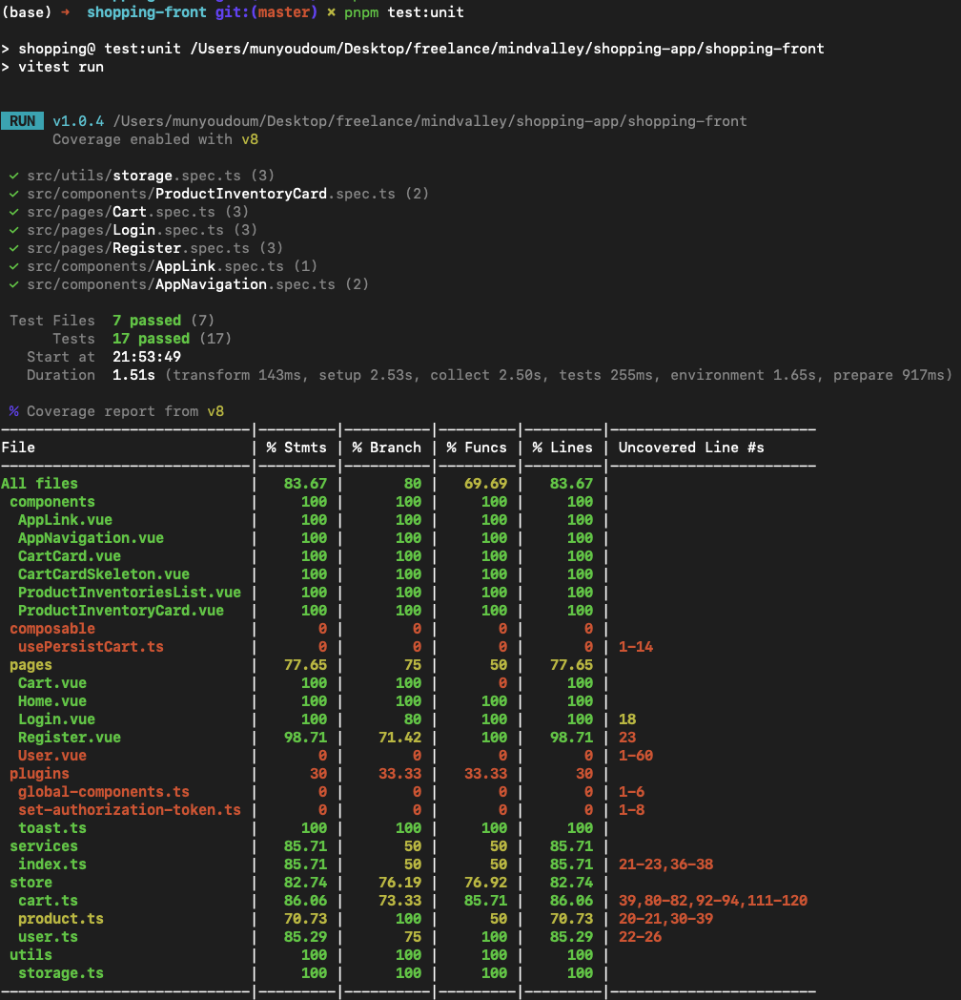
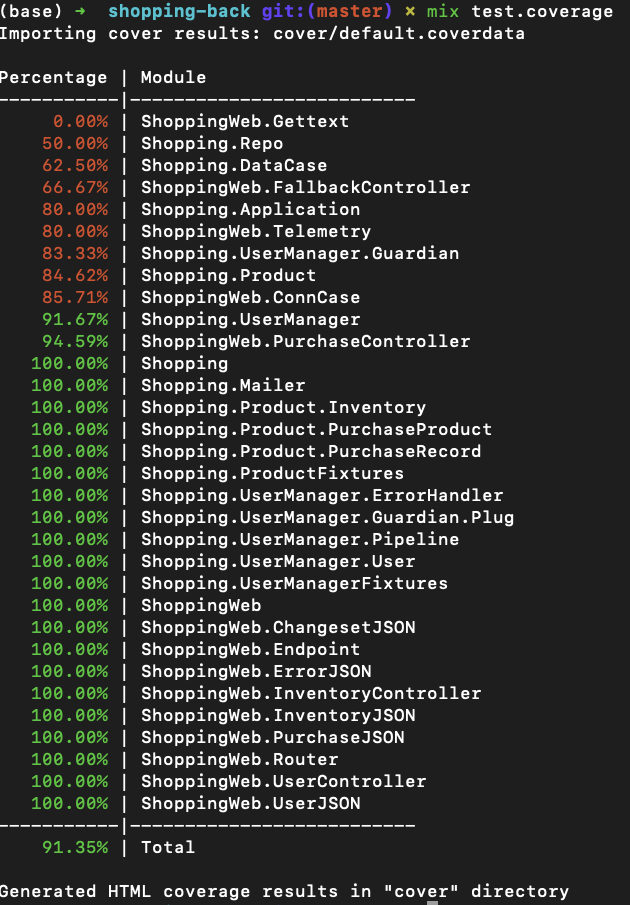

# Notes

## Front

### Info
- HTTP Client `src/services/api.ts` is mainly from https://github.com/acacode/swagger-typescript-api, so there are some unused methods for this project
- Cart Storage is stored in browser local storage
- Product list is stored in pinia store globally to be able to access from Cart
-  User token is stored in browser local storage
- I think we can improve more on UI, and also loading skeletons for products

## Back

### Info
- Most of design are based on the [Phoenix](https://hexdocs.pm/phoenix/overview.html) framework
- I used argon2 for hashing passwords and guardian for JWT authentication as recommended [here](https://hexdocs.pm/guardian/tutorial-start.html#specify-your-dependencies)
- `/product_inventories` endpoint is automatically generated, so there are some API methods that are not used and should be removed
- I put `FOR UPDATE NOWAIT` when getting list of `product_inventories` to lock the rows for purchase, so if there are multiple requests to purchase the same product, only one will be able to purchase it

### Database:
#### Tables:
- `users`
- `product_inventories`
- `purchase_records`
- `purchase_products`: I added this one to keep track of each product price and quality of each purchase record

## Extras

### Tests Coverage

