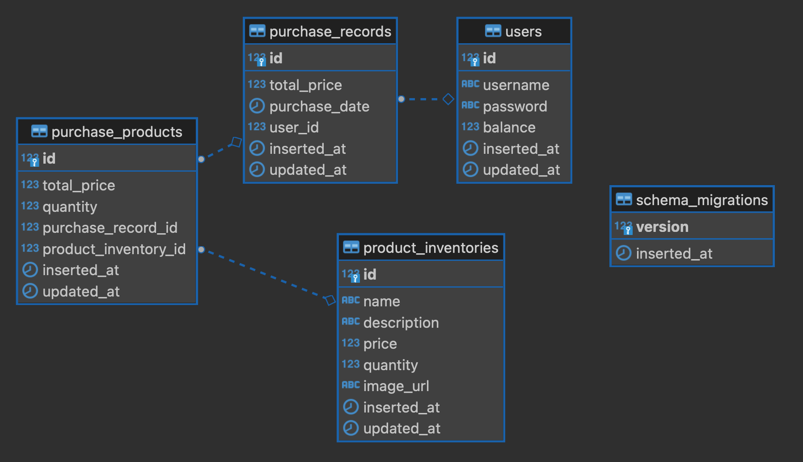

# Shopping

## Installing

To run this project, you will need to install the following dependencies on your system:

* [Elixir](https://elixir-lang.org/install.html)
* [Phoenix](https://hexdocs.pm/phoenix/installation.html)
* [PostgreSQL](https://www.postgresql.org/download)

### For docker users

If you have docker installed, you can run the following command to start a postgres container:

```shell
docker run --name shopping_dev -e POSTGRES_PASSWORD=postgres -p 5432:5432 -d postgres
```

### For non-docker users

If you don't have docker installed, you can install PostgreSQL on your system and update the configuration in `config/dev.exs` and `config/test.exs` files.


## Running the project

### To start your Phoenix server:

  * Run `mix setup` to install and setup dependencies
  * Start Phoenix endpoint with `mix phx.server` or inside IEx with `iex -S mix phx.server`

Now you can visit [`localhost:4000`](http://localhost:4000) from your browser.

### To seed database

  * Run `mix run priv/repo/seeds.exs`

### Tests

  * Run `mix test` to run tests

### Database



## Learn more

  * Official website: https://www.phoenixframework.org/
  * Guides: https://hexdocs.pm/phoenix/overview.html
  * Docs: https://hexdocs.pm/phoenix
  * Forum: https://elixirforum.com/c/phoenix-forum
  * Source: https://github.com/phoenixframework/phoenix

Ready to run in production? Please [check our deployment guides](https://hexdocs.pm/phoenix/deployment.html).
